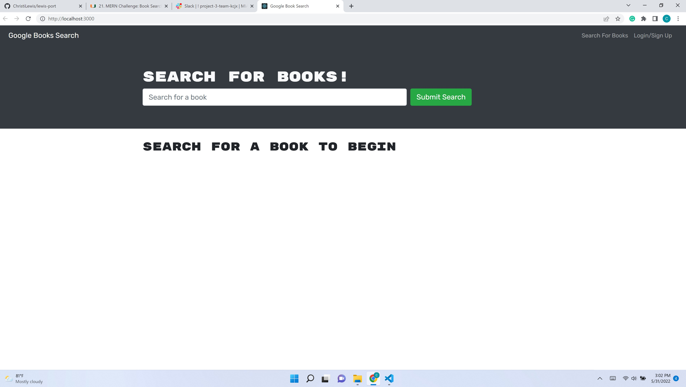

# book-f-ish

## Overview
Transform a fully functional Googlebooks app that is setup with a MERN stack using RESTful API and refactor it to be a GraphQL API built with an Apollo Sever. Specifically, this project does the following from the Assignment criteria:
1) Set up an Apollo Server to use GraphQL queries and mutations to fetch and modify data, replacing the existing RESTful API.

2) Modify the existing authentication middleware so that it works in the context of a GraphQL API.

3) Create an Apollo Provider so that requests can communicate with an Apollo Server.

4) Deploy the application to Heroku.

## Contents
  * [Overview](#overview),
  * [Table of Contents](#contents),
  * [Description](#description),
  * [Installation](#installation),
  * [Notes](#notes),
  * [Usage](#usage),
  * [Credits](#credits),
  * [License](#license),
  * [Badges](#badges),
  * [Features](#features),
  * [Contribute](#contribute),
  * [Tests](#tests)

  ## Description
  * Advantages of the GraphQL API system are numerous, economical and efficient.
  * To streamline data management, it seems there will be much work ahead to transform RESTful APIs, in reality, merge the Apollo system with the RESTful API. 
  * This is generally a real-world scenario client request project.

  ## Installation
  * As a deployed application, there are no special instructions for use.  However, as a scop-of-work outline, there are several painstaking steps required in a particular sequence to make a smooth transition.  

## Usage

Criteria from the Module 21 Challenge:
>GIVEN a book search engine
WHEN I load the search engine
THEN I am presented with a menu with the options Search for Books and Login/Signup and an input field to search for books and a submit button
>
WHEN I click on the Search for Books menu option
THEN I am presented with an input field to search for books and a submit button
>
WHEN I am not logged in and enter a search term in the input field and click the submit button
THEN I am presented with several search results, each featuring a book’s title, author, description, image, and a link to that book on the Google Books site
>
WHEN I click on the Login/Signup menu option
THEN a modal appears on the screen with a toggle between the option to log in or sign up
>
WHEN the toggle is set to Signup
THEN I am presented with three inputs for a username, an email address, and a password, and a signup button
>
WHEN the toggle is set to Login
THEN I am presented with two inputs for an email address and a password and login button
>
WHEN I enter a valid email address and create a password and click on the signup button
THEN my user account is created and I am logged in to the site
>
WHEN I enter my account’s email address and password and click on the login button
THEN I the modal closes and I am logged in to the site
>
WHEN I am logged in to the site
THEN the menu options change to Search for Books, an option to see my saved books, and Logout
>
WHEN I am logged in and enter a search term in the input field and click the submit button
THEN I am presented with several search results, each featuring a book’s title, author, description, image, and a link to that book on the Google Books site and a button to save a book to my account
>
WHEN I click on the Save button on a book
THEN that book’s information is saved to my account
>
WHEN I click on the option to see my saved books
THEN I am presented with all of the books I have saved to my account, each featuring the book’s title, author, description, image, and a link to that book on the Google Books site and a button to remove a book from my account
>
WHEN I click on the Remove button on a book
THEN that book is deleted from my saved books list
>
WHEN I click on the Logout button
THEN I am logged out of the site and presented with a menu with the options Search for Books and Login/Signup and an input field to search for books and a submit button
Mock-Up
>

  * 
  <!-- *  -->

  * [GitHub Repo](https://github.com/ChristiLewis/book-f-ish)

    ## Credits
  * [UM Coding Bootcamp](https://bootcamp.miami.edu/coding/)
  * [ChristiLewis](https://github.com/ChristiLewis)

## License
* Contents are credited as inspired by the bootcamp, API documentation licensing requirements, and as per permission by the team members mentioned above. All content by the UM Bootcamp has a MIT License.

## Badges
* There are no badges generated at this time. For more information: [shields.io](https://shields.io/)

## Features
* Realtime, anywhere interactions

## How-to-Contribute
* Any recommendations?  Please see [contributorCovenant](https://www.contributor-covenant.org)

## Tests
* There are no tests at this time, we are open to suggestions.
  